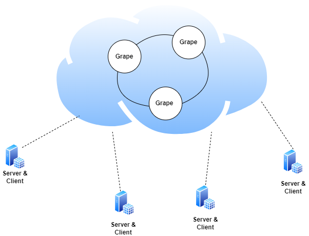

# Order Matching Engine

We are using Grape to manage our Distributed Hash Table. Using Grape, Grenache provides a light weight abstraction to communicate with each node in the DHT. 

For the scope of this service, each node can send message to itself and other nodes attached in the network. Node are represented as `Exchange` and can act both as client or server i.e each node has capability of processing and placing orders in the system. Each node or exchange maintains it's own copy of OrderBook to track orders places on itself, and utilises other exchanges OrderBooks to fill orders. 




## Sequence Diagram


# Functional Requirements 
- [x] Each node maintains it's own OrderBook.
- [x] Any order is first placed at its local node. Local node tried to fill it, it is can not fill the order it then asks other nodes in network for potential matching orders.
- [x] Partial orders can be filled if appropriate matching order is present. Remainer order in put in OrderBook to be filled later.
- [x] Once order is filled all participating nodes update their OrderBook.

# How to Run
* Clone the repository.
* Execute `npm install` from inside the repository folder.
* Execute `npm i -g grenache-grape` to install Grenache.
* Execute `npm run grapes` to start grapes server.
* To simulate the trades, you can use multiple terminals to execute the commands
   * `$ node sim.js <PORT> exec <ORDER_TYPE> <COIN> <QUANTITY> <PRICE>`
     * Sample - `$ node sim.js 1450 exec SELL BTC 5 1000`
   * `PORT` - Any system port eg. 1337
   * `ORDER_TYPE` - Type of order. Use either `BUY` or `SELL`
   * `COIN` - Type of Coin/stock you are trading, eg. BTC
   * `QUANTITY` - Quantity of coin, eg. 5
   * `PRICE` - Price/cost of one coin. eg. 30
 * To simulate multple trade, execute above command in multiple terminals, each terminal acts as a node in this exchange engine.
 * Once processing is complete, final snapshot of order book can be found in root directory in `.json` file. There will be `x` files if `x` nodes are there in the network executing trades. 
  
> NOTE: Implementation uses `crypto.randomInt()` to generate random reader friendly values. It takes a maxium integer to generate random values, which is kept `100`. So, make sure you don't create more than 100 orders per node or more than 100 node in the network.

# Scope for Improvement
* Implement safety checks while processing order to make sure one order is processing only at one exchange at a time.
* Improve error handling and retries.
* Move OrderBook to Blockchain or DDB for persistance.
* Re-factor Exchange.js class to abstract out message handlers.

# Frequent Errors

```
/mnt/e/Projects/peer-to-peer/order-matching-engine/node_modules/grenache-nodejs-http/lib/TransportRPCClient.js:89
        this.handleReply(req.rid, new Error(`ERR_REQUEST_GENERIC: ${err.message}`))
                                  ^

Error: ERR_REQUEST_GENERIC: connect ECONNREFUSED 127.0.0.1:1467
    at /mnt/e/Projects/peer-to-peer/order-matching-engine/node_modules/grenache-nodejs-http/lib/TransportRPCClient.js:89:35
    at cb (/mnt/e/Projects/peer-to-peer/order-matching-engine/node_modules/grenache-nodejs-http/lib/TransportRPCClient.js:134:7)
    at Request._callback (/mnt/e/Projects/peer-to-peer/order-matching-engine/node_modules/grenache-nodejs-http/lib/TransportRPCClient.js:139:16)
```

If you face an error like above while running the service, just try and restart Greapes by ending the Grapes process and restart using `npm run grapes` command.